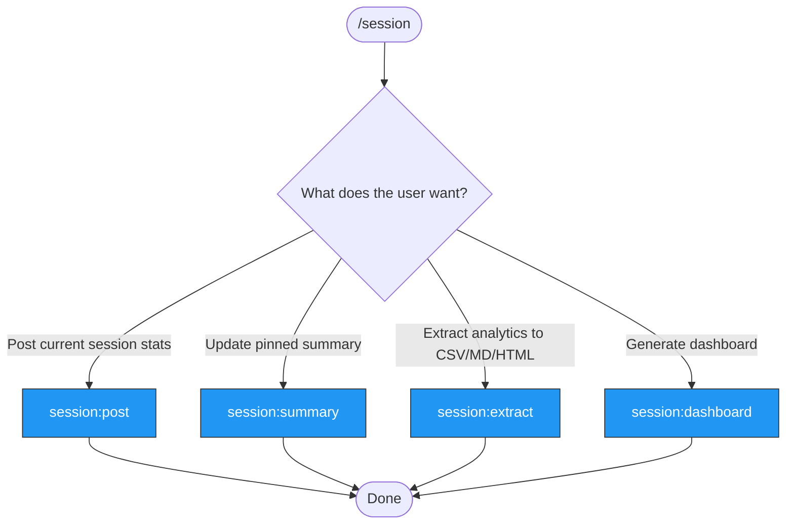

> Follow this diagram as the workflow.

# Session Analytics

Track and report Claude Code session metadata on GitHub PRs and issues.

## Auto-Select Sub-Skill

When this skill is invoked, determine the right sub-skill based on context:

```
What does the user want?
    |
    +- Post current session stats to a PR/issue
    |   -> Use `session:post`
    |
    +- Update the pinned summary comment on a PR/issue
    |   -> Use `session:summary`
    |
    +- Extract analytics to CSV/MD/HTML files
    |   -> Use `session:extract`
    |
    +- Generate an HTML dashboard
        -> Use `session:dashboard`
```

## Available Skills

| Skill | Purpose | When |
|-------|---------|------|
| `session:post` | Post session stats to PR/issue comment | After a session, want to record stats |
| `session:summary` | Update pinned summary comment | Refresh aggregated stats on PR/issue |
| `session:extract` | Extract analytics to CSV/MD/HTML | Need offline analysis or reporting |
| `session:dashboard` | Generate HTML dashboard | Visual overview of session metrics |

## Quick Post

```bash
# Post current session stats to the PR for the current branch
python3 .claude/scripts/session-analytics.py --session-id <ID> --target pr --number <N> --repo <OWNER/NAME>
```

## Related Skills

- `session:post` - Post session stats to PR/issue comment
- `session:summary` - Update pinned summary comment
- `session:extract` - Extract analytics to CSV/MD/HTML
- `session:dashboard` - Generate HTML dashboard
