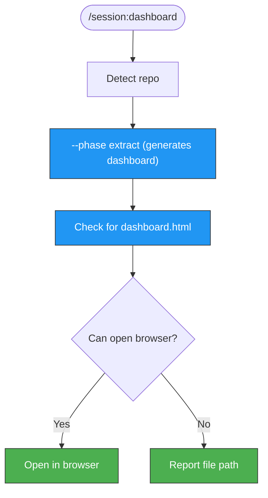

> Follow this diagram as the workflow.

# Generate HTML Dashboard

Generate an interactive HTML dashboard visualizing Claude Code session analytics across PRs and issues.

## Workflow

### Step 1: Detect Repository

```bash
git remote get-url origin | sed 's/.*github.com[:/]\(.*\)\.git/\1/' | sed 's/.*github.com[:/]\(.*\)/\1/'
```

### Step 2: Run the Extract Phase

The dashboard is generated as part of the extract phase:

```bash
python3 .claude/scripts/session-analytics.py \
  --phase extract \
  --repo <OWNER/NAME> \
  --output-dir /tmp/kagenti/session/
```

This generates all output files including the `dashboard.html`.

### Step 3: Verify the Dashboard

```bash
ls -la /tmp/kagenti/session/dashboard.html
```

### Step 4: Open in Browser

Attempt to open the dashboard in the default browser:

```bash
# macOS
open /tmp/kagenti/session/dashboard.html

# Linux
xdg-open /tmp/kagenti/session/dashboard.html 2>/dev/null || echo "Open manually: /tmp/kagenti/session/dashboard.html"
```

If the browser cannot be opened (e.g., headless environment), report the file path so the user can open it manually.

## Dashboard Contents

The HTML dashboard typically includes:
- Total sessions, tokens, and cost overview
- Token usage over time (line chart)
- Tool usage distribution (pie chart)
- Per-PR/issue breakdown table
- Session duration trends

## Parameters

| Parameter | Source | Required | Default |
|-----------|--------|----------|---------|
| `--phase` | Always `extract` | Yes | - |
| `--repo` | Auto-detected from git remote | Yes | - |
| `--output-dir` | Fixed | No | `/tmp/kagenti/session/` |
| `--from-date` | Optional date range start | No | 30 days ago |
| `--to-date` | Optional date range end | No | Today |

## Examples

```bash
# Generate dashboard for last 30 days
python3 .claude/scripts/session-analytics.py \
  --phase extract --repo kagenti/kagenti \
  --output-dir /tmp/kagenti/session/

# Generate and open
python3 .claude/scripts/session-analytics.py \
  --phase extract --repo kagenti/kagenti \
  --output-dir /tmp/kagenti/session/ && open /tmp/kagenti/session/dashboard.html
```

## Related Skills

- `session` - Router skill for all session analytics
- `session:post` - Post session stats to PR/issue comment
- `session:summary` - Update pinned summary comment
- `session:extract` - Extract analytics to CSV/MD/HTML
