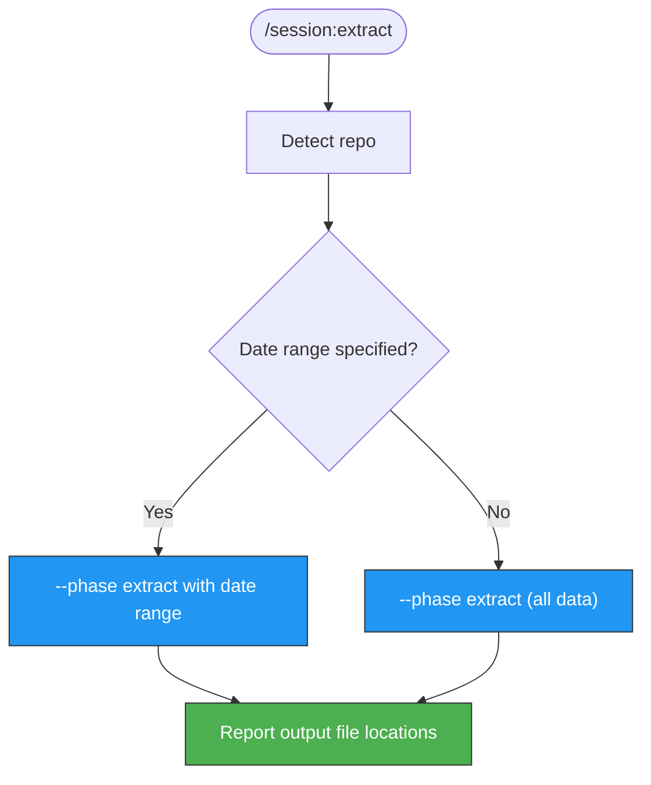

> Follow this diagram as the workflow.

# Extract Session Analytics

Extract Claude Code session analytics from GitHub PR/issue comments into CSV, Markdown, or HTML files for offline analysis and reporting.

## Workflow

### Step 1: Detect Repository

```bash
git remote get-url origin | sed 's/.*github.com[:/]\(.*\)\.git/\1/' | sed 's/.*github.com[:/]\(.*\)/\1/'
```

### Step 2: Determine Date Range

Ask the user or accept parameters:
- `--from-date` - Start date (ISO format: `YYYY-MM-DD`), defaults to 30 days ago
- `--to-date` - End date (ISO format: `YYYY-MM-DD`), defaults to today

### Step 3: Run the Extract Phase

```bash
python3 .claude/scripts/session-analytics.py \
  --phase extract \
  --repo <OWNER/NAME> \
  --from-date <START_DATE> \
  --to-date <END_DATE> \
  --output-dir /tmp/kagenti/session/
```

This will:
1. Fetch session comments from all PRs/issues in the date range
2. Parse session metrics from each comment
3. Generate output files in `/tmp/kagenti/session/`:
   - `sessions.csv` - Raw session data in CSV format
   - `sessions.md` - Formatted Markdown report
   - `dashboard.html` - Interactive HTML dashboard

### Step 4: Report Output

After extraction completes, report the output file locations to the user:

```bash
ls -la /tmp/kagenti/session/
```

Provide the full paths so the user can open or share the files.

## Parameters

| Parameter | Source | Required | Default |
|-----------|--------|----------|---------|
| `--phase` | Always `extract` | Yes | - |
| `--repo` | Auto-detected from git remote | Yes | - |
| `--from-date` | User-specified or default | No | 30 days ago |
| `--to-date` | User-specified or default | No | Today |
| `--output-dir` | Fixed | No | `/tmp/kagenti/session/` |

## Examples

```bash
# Extract last 30 days (default)
python3 .claude/scripts/session-analytics.py \
  --phase extract --repo kagenti/kagenti \
  --output-dir /tmp/kagenti/session/

# Extract specific date range
python3 .claude/scripts/session-analytics.py \
  --phase extract --repo kagenti/kagenti \
  --from-date 2025-01-01 --to-date 2025-01-31 \
  --output-dir /tmp/kagenti/session/

# Extract all time
python3 .claude/scripts/session-analytics.py \
  --phase extract --repo kagenti/kagenti \
  --from-date 2024-01-01 \
  --output-dir /tmp/kagenti/session/
```

## Output Files

| File | Format | Use Case |
|------|--------|----------|
| `sessions.csv` | CSV | Import into spreadsheets, data analysis tools |
| `sessions.md` | Markdown | Share in docs, wikis, or other PRs |
| `dashboard.html` | HTML | Visual overview, open in browser |

## Related Skills

- `session` - Router skill for all session analytics
- `session:post` - Post session stats to PR/issue comment
- `session:summary` - Update pinned summary comment
- `session:dashboard` - Generate HTML dashboard
