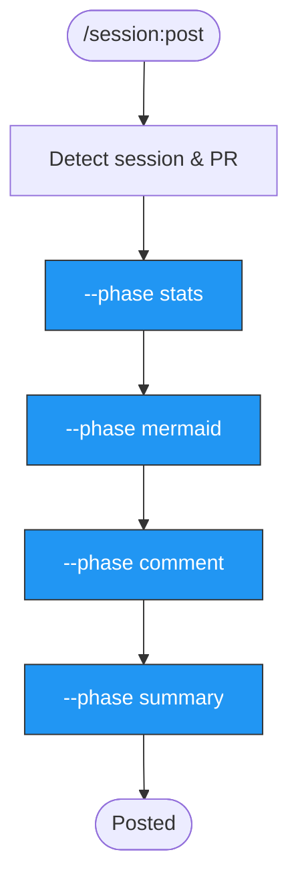

> Follow this diagram as the workflow.

# Post Session Stats

Post the current Claude Code session statistics to a GitHub PR or issue as a formatted comment.

## Workflow

### Step 1: Detect Session ID

Find the most recent JSONL session file for this project:

```bash
# List recent session files
ls -t ~/.claude/projects/*/session_*.jsonl 2>/dev/null | head -5
```

The session ID is extracted from the JSONL filename (e.g., `session_abc123.jsonl` -> `abc123`).

If multiple sessions exist, use the most recent one unless the user specifies a different session.

### Step 2: Detect PR Number

Auto-detect the PR from the current git branch:

```bash
gh pr list --head "$(git branch --show-current)" --json number --jq '.[0].number'
```

If no PR is found for the current branch, ask the user:
- Would they like to post to a specific issue instead?
- Provide the issue number with `--target issue --number <N>`

### Step 3: Detect Repository

Extract the repository owner/name from the git remote:

```bash
git remote get-url origin | sed 's/.*github.com[:/]\(.*\)\.git/\1/' | sed 's/.*github.com[:/]\(.*\)/\1/'
```

### Step 4: Run the Full Pipeline

Execute all phases of the analytics pipeline:

```bash
python3 .claude/scripts/session-analytics.py \
  --session-id <SESSION_ID> \
  --target pr \
  --number <PR_NUMBER> \
  --repo <OWNER/NAME>
```

This runs the following phases in sequence:
1. **stats** - Parse the JSONL file and compute metrics (tokens, costs, tool usage, duration)
2. **mermaid** - Generate mermaid diagrams (tool distribution pie chart, timeline)
3. **comment** - Format and post the session comment to the PR/issue
4. **summary** - Update the pinned summary comment with aggregated stats

### Step 5: Verify

Confirm the comment was posted successfully:

```bash
gh pr view <PR_NUMBER> --json comments --jq '.comments[-1].body[:200]'
```

## Parameters

| Parameter | Source | Required |
|-----------|--------|----------|
| `--session-id` | Auto-detected from JSONL files | Yes |
| `--target` | `pr` or `issue` | Yes (default: `pr`) |
| `--number` | Auto-detected from branch | Yes |
| `--repo` | Auto-detected from git remote | Yes |

## Examples

```bash
# Auto-detect everything and post to PR
python3 .claude/scripts/session-analytics.py \
  --session-id abc123 --target pr --number 42 --repo kagenti/kagenti

# Post to a specific issue instead
python3 .claude/scripts/session-analytics.py \
  --session-id abc123 --target issue --number 100 --repo kagenti/kagenti
```

## Related Skills

- `session` - Router skill for all session analytics
- `session:summary` - Update pinned summary comment
- `session:extract` - Extract analytics to CSV/MD/HTML
- `session:dashboard` - Generate HTML dashboard
