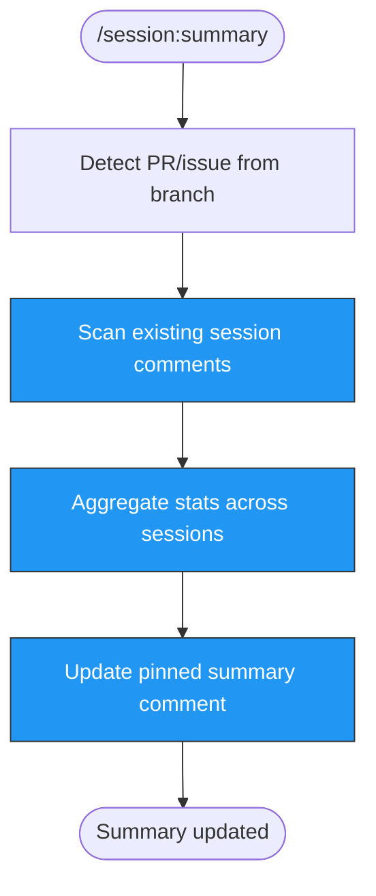

> Follow this diagram as the workflow.

# Update Pinned Summary

Update the pinned summary comment on a GitHub PR or issue. The summary always recalculates from individual session comments already posted on the PR/issue.

## Workflow

### Step 1: Detect PR/Issue Number

Auto-detect the PR from the current git branch:

```bash
gh pr list --head "$(git branch --show-current)" --json number --jq '.[0].number'
```

If no PR is found, ask the user for an issue number.

### Step 2: Detect Repository

```bash
git remote get-url origin | sed 's/.*github.com[:/]\(.*\)\.git/\1/' | sed 's/.*github.com[:/]\(.*\)/\1/'
```

### Step 3: Run the Summary Phase

Execute the summary phase of the analytics pipeline:

```bash
python3 .claude/scripts/session-analytics.py \
  --phase summary \
  --number <PR_OR_ISSUE_NUMBER> \
  --repo <OWNER/NAME>
```

This will:
1. Fetch all comments on the PR/issue
2. Identify session stat comments (by their marker format)
3. Aggregate metrics across all sessions (total tokens, costs, tool calls, duration)
4. Create or update the pinned summary comment at the top of the conversation

### Step 4: Verify

Confirm the summary was updated:

```bash
gh pr view <NUMBER> --json comments --jq '[.comments[] | select(.body | contains("Session Summary"))] | length'
```

## Parameters

| Parameter | Source | Required |
|-----------|--------|----------|
| `--phase` | Always `summary` | Yes |
| `--number` | Auto-detected from branch | Yes |
| `--repo` | Auto-detected from git remote | Yes |

## Notes

- The summary comment is idempotent: running it multiple times updates the same comment
- It recalculates from scratch each time, so it always reflects the latest session data
- If no session comments exist on the PR/issue, the summary will indicate zero sessions

## Related Skills

- `session` - Router skill for all session analytics
- `session:post` - Post session stats to PR/issue comment
- `session:extract` - Extract analytics to CSV/MD/HTML
- `session:dashboard` - Generate HTML dashboard
