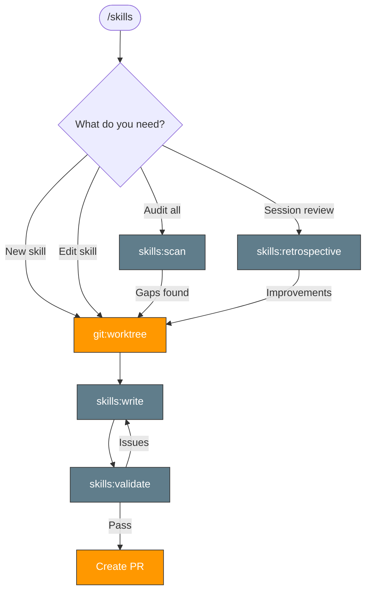

> Follow this diagram as the workflow.

# Skills Management

Skills for managing the skill system itself. **All skill development starts in a worktree** — never edit skills directly on main.

## Worktree-First Gate

Before creating or editing any skill, create a worktree:

```bash
git fetch upstream main
```

```bash
git worktree add .worktrees/skills-<topic> -b docs/skills-<topic> upstream/main
```

Then work in the worktree, validate, and create a PR.

## Available Skills

| Skill | Purpose |
|-------|---------|
| `skills:write` | Create new skills or edit existing ones following the standard template |
| `skills:validate` | Validate skill format, naming, and structure |
| `skills:scan` | Audit repository skills — gaps, quality, connections, diagrams |
| `skills:retrospective` | End-of-session review to identify skill gaps and improvements |

## Related Skills

- `git:worktree` - Create worktrees for skill development
- `tdd:ci` - TDD workflow that uses skill patterns
- `rca:ci` - RCA workflow that uses skill patterns
- `meta:write-docs` - Documentation writing guidelines

## Developer Guide

See [docs/developer/claude-code-skills.md](../../docs/developer/claude-code-skills.md) for the full guide on why skills exist, how the system works, and best practices.
