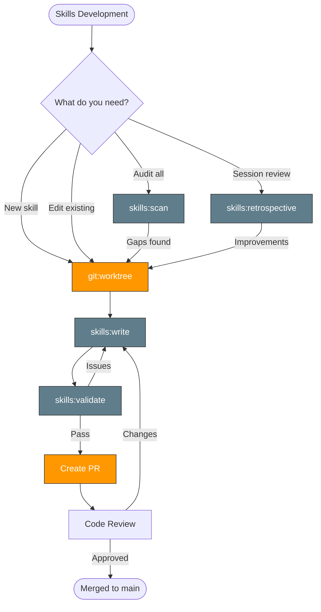
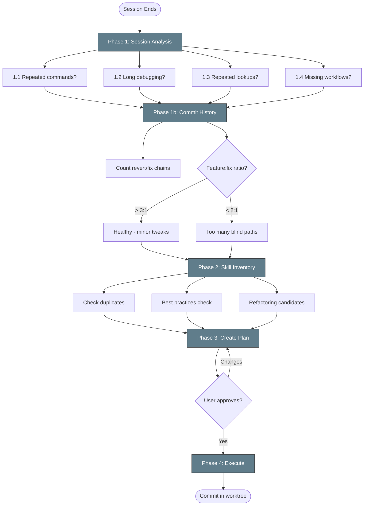

# Claude Code Skills Development

Guide for developing, maintaining, and improving Claude Code skills in the Kagenti repository.

## Table of Contents

- [What Are Skills?](#what-are-skills)
- [Why Skills?](#why-skills)
- [The Skills System](#the-skills-system)
- [Skills Lifecycle](#skills-lifecycle)
- [Sub-Skill Reference](#sub-skill-reference)
- [Development Workflow](#development-workflow)
- [Retrospective Deep Dive](#retrospective-deep-dive)
- [Best Practices](#best-practices)

## What Are Skills?

Skills are structured SKILL.md files in `.claude/skills/` that teach Claude Code how to perform specific tasks. Each skill provides:

- **Decision trees** — when to use which approach
- **Copy-pasteable commands** — real commands, not pseudocode
- **Workflow diagrams** — mermaid flowcharts showing the process
- **Troubleshooting guides** — common problems and fixes
- **Cross-references** — links to related skills

Skills are NOT documentation. They are **executable instructions** that Claude Code follows step-by-step. The difference matters: documentation explains concepts; skills give orders.

## Why Skills?

Without skills, Claude Code:
- Guesses at command syntax and flags
- Takes wrong approaches, reverts, tries again (wasted iterations)
- Misses environment-specific constraints (Kind vs HyperShift vs CI)
- Doesn't know the team's preferred patterns and conventions
- Forgets lessons from previous sessions

With skills:
- **Consistent behavior** — every session follows the same proven patterns
- **Fewer blind paths** — decision trees prevent wrong-approach guessing
- **Faster iteration** — pre-tested commands, no trial-and-error
- **Knowledge retention** — lessons learned are encoded, not lost between sessions
- **Scalable** — new team members (human or AI) get the same playbook

## The Skills System



### Skill Types

| Type | Example | Has Diagram? | Description |
|------|---------|:---:|-------------|
| **Router** | `tdd/`, `rca/`, `ci/` | Yes | Picks the right sub-skill based on context |
| **Workflow** | `tdd:ci`, `rca:kind`, `skills:scan` | Yes | Multi-step process with phases |
| **Reference** | `k8s:pods`, `auth:keycloak-*` | No | Commands and troubleshooting for a topic |
| **Index** | `git/`, `k8s/`, `auth/` | No | Lists sub-skills, no routing logic |

### Naming Conventions

```
.claude/skills/<category>:<name>/SKILL.md
```

- **Category** = domain area (tdd, rca, k8s, git, skills, etc.)
- **Name** = specific skill within that category
- **Colon notation** is required — Claude Code uses it for skill discovery
- Directory name MUST match the `name:` field in frontmatter

## Skills Lifecycle

### 1. `skills:scan` — Audit and Discover

Scans the repository and compares the tech stack against existing skills. Identifies gaps, stale skills, broken references, and quality issues. Produces a structured report.

**Use when**: onboarding to a repo, after tech stack changes, periodic hygiene.

### 2. `skills:write` — Create New Skills

Provides the template, checklist, and conventions for creating a new skill. Covers frontmatter, content guidelines, command format (sandbox vs management), workflow diagrams, and task tracking.

`skills:write` handles both creating new skills and editing existing ones. When editing, read the skill first, apply the same checklist, and ensure the diagram still matches the textual flow.

**Use when**: creating a new skill, or making significant edits to an existing one.

### 3. `skills:validate` — Check Quality

Validates that skills meet the standard: frontmatter, naming, diagram presence, command format, auto-approve coverage. Can validate a single skill or all skills at once.

**Use when**: after writing/editing a skill, before committing.

### 4. `skills:retrospective` — Learn from Sessions

Reviews the current session's work to identify skill gaps, blind paths, and improvement opportunities. Analyzes commit history for revert/fix chains that indicate wasted iterations. Proposes a plan for skill improvements.

**Use when**: after significant sessions, when you notice repeated patterns, periodically.

## Sub-Skill Reference

| Skill | Input | Output | Invokes |
|-------|-------|--------|---------|
| `skills:scan` | Repository | Gap report + recommendations | `skills:validate`, `skills:write` |
| `skills:write` | Skill name + content | New/updated SKILL.md | `skills:validate` |
| `skills:validate` | Skill file(s) | Pass/fail with issues | — |
| `skills:retrospective` | Session history | Improvement plan | `skills:write` |

### Data Flow

```
Session work → skills:retrospective → identifies gaps
                                           ↓
Repository → skills:scan → identifies gaps + stale skills
                                           ↓
                              skills:write (in worktree)
                                           ↓
                              skills:validate → pass?
                                           ↓
                              PR → review → merge
```

## Development Workflow

**All skill development happens in a worktree.** This keeps the main branch clean and allows skill changes to go through PR review like any other code change.

### Step 1: Create a worktree

```bash
git fetch upstream main
git worktree add .worktrees/skills-<topic> -b docs/skills-<topic> upstream/main
```

### Step 2: Write or edit skills

Work in the worktree. Follow `skills:write` for new skills, or read-then-edit for existing ones.

### Step 3: Validate

Run `skills:validate` on changed skills. Check:
- Frontmatter matches directory name
- Mermaid diagram matches textual flow (for workflow/router skills)
- Commands are copy-pasteable and auto-approve-compatible
- Related Skills section links are valid

### Step 4: Update cross-references

If you added a new skill:
- Update the parent category SKILL.md
- Update `.claude/skills/README.md` skill tree
- Check if CLAUDE.md needs updating

### Step 5: Create PR

Push the worktree branch and create a PR. Skill PRs should be small and focused — one logical change per PR.

### Step 6: Clean up

After merge:
```bash
git worktree remove .worktrees/skills-<topic>
```

## Retrospective Deep Dive

The `skills:retrospective` skill is the feedback loop that makes the skills system self-improving. Here is a detailed analysis of how it works and what to watch for.

### What It Does Well

**Phase 1 (Session Analysis)** catches the right signals:
- Repeated commands → should be in a skill
- Long debugging cycles → missing decision tree
- Repeated lookups → missing reference
- Missing workflows → missing prerequisite chain

**Phase 1b (Commit History)** is particularly valuable:
- Counts revert/fix chains to measure wasted iterations
- Classifies blind paths by root cause (wrong approach, missing diagnostic, env constraint)
- The 3:1 feature:fix ratio benchmark is a concrete metric

**Phase 3 (Plan)** forces approval before changes, preventing skill sprawl.

### What to Watch For

**Risk: Analysis paralysis.** Phase 1 + 1b can generate a long list of potential improvements. Not everything needs a skill. Prioritize by frequency — if a pattern appeared once, it might not recur. If it appeared three times, it will.

**Risk: Over-splitting.** The "split skills over 200 lines" guidance can lead to splitting skills that are naturally cohesive. A 250-line skill that covers one complete workflow is better than two 125-line skills that require context-switching.

**Risk: Stale retrospective plans.** The plan template writes to `docs/SKILL_RETROSPECTIVE_<date>.md` but there's no mechanism to track whether plans were executed. Old plans can accumulate.

**Risk: Missing the forest.** Phase 2 (Skill Inventory) checks individual skills but doesn't assess whether the overall skill graph makes sense — are there orphaned skills? Circular dependencies? Missing escalation paths?

### When to Run It

The retrospective is most valuable when:
- You just finished a multi-hour debugging session (lots of signal)
- You onboarded to a new area and hit friction (fresh-eyes perspective)
- The feature:fix ratio in recent commits drops below 2:1

It's less valuable when:
- The session was routine and went smoothly (little signal)
- You're mid-task and need to keep momentum (context-switch cost)

### Diagram



## Best Practices

### Do

- **Start in a worktree** — always branch from upstream/main
- **One concern per skill** — a skill should do one thing well
- **Test commands** — every command in a skill should be copy-pasteable and work
- **Match diagram to text** — if the text says "Phase 1, 2, 3", the diagram must show 1→2→3
- **Use the checklist** — `skills:write` has a pre-commit checklist, use it every time
- **Run validate** — `skills:validate` catches issues before reviewers do
- **Cross-reference** — update parent SKILL.md and README when adding skills
- **Keep it actionable** — commands and decisions, not explanations

### Don't

- **Don't write documentation** — skills are instructions, not explanations
- **Don't create skills for one-time tasks** — only encode patterns that recur
- **Don't skip the worktree** — direct commits to main bypass review
- **Don't ignore the retrospective** — the feedback loop is what makes skills improve over time
- **Don't duplicate** — check existing skills before creating new ones
- **Don't over-abstract** — three similar lines of commands is better than a premature helper skill

## Related Documentation

- [Skills README](../../.claude/skills/README.md) — complete skill tree and workflow diagrams
- [AI Ops](../ai-ops/README.md) — broader Claude Code workflows
- [CLAUDE.md](../../CLAUDE.md) — repository-level instructions
