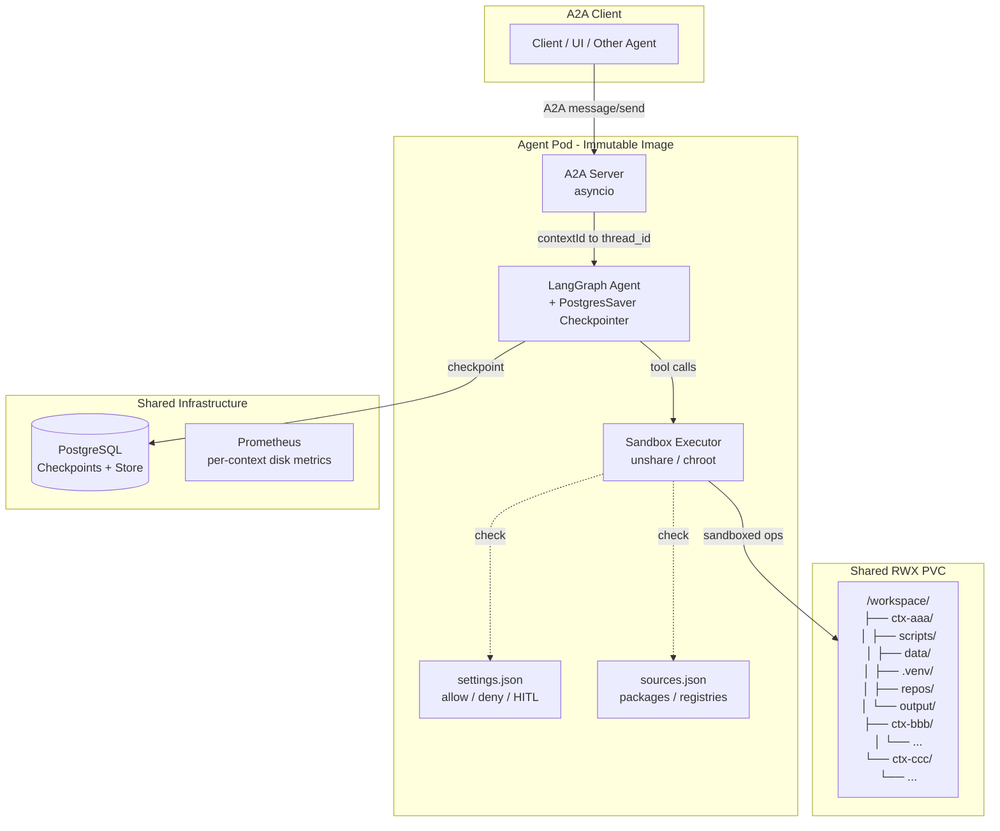
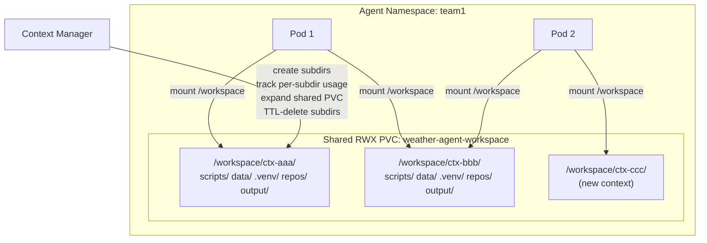
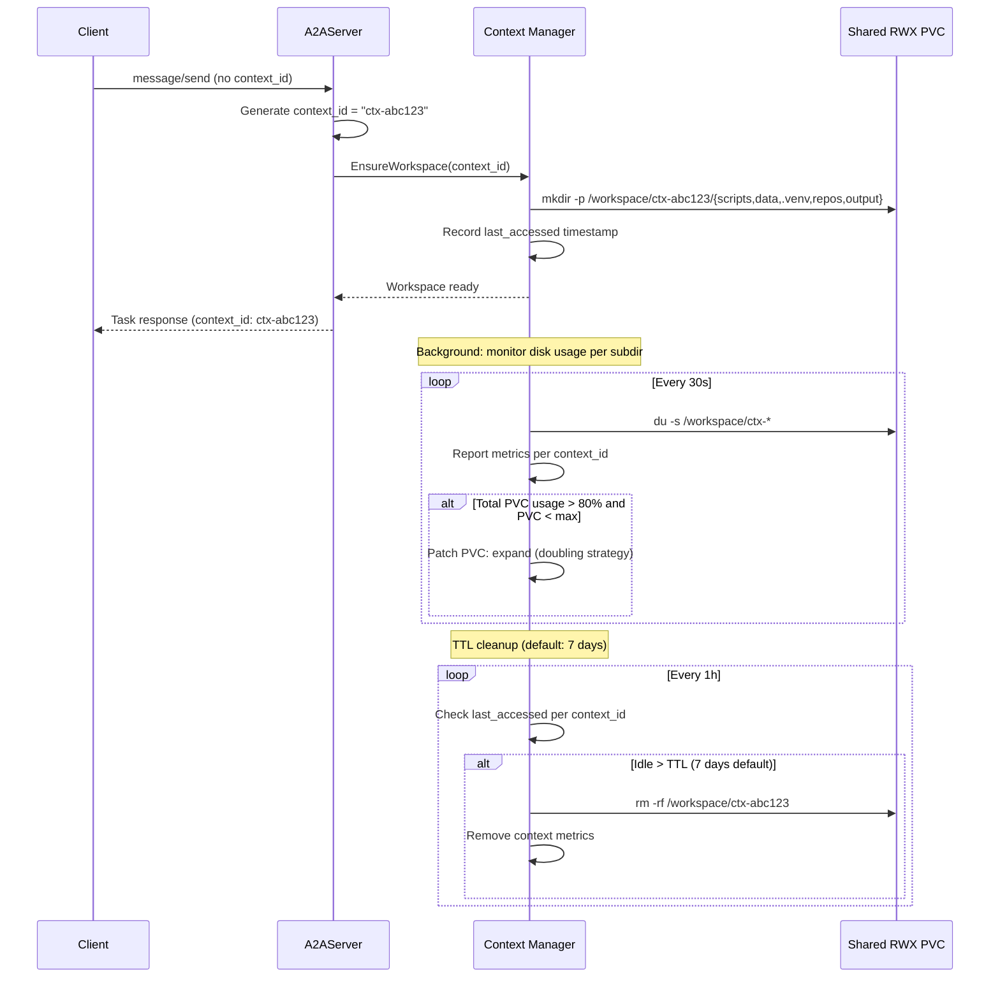
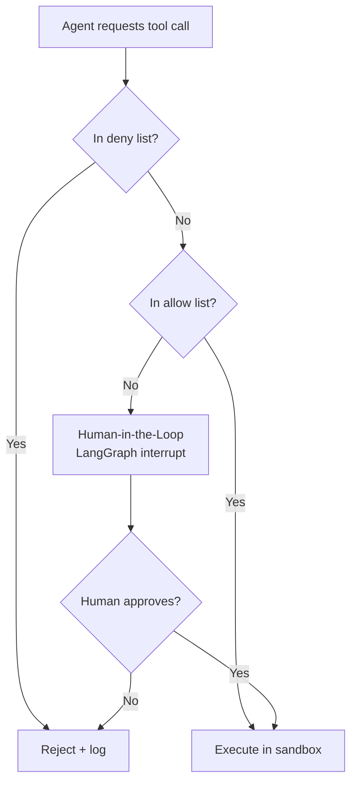
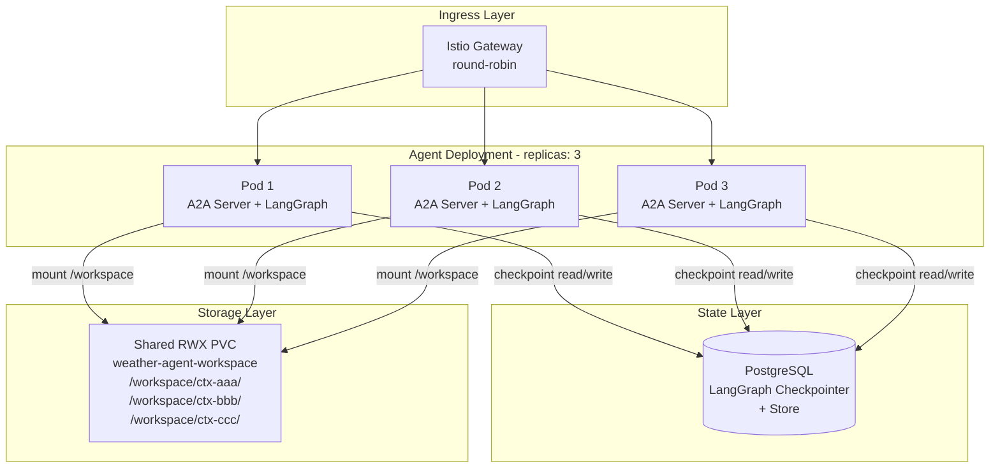
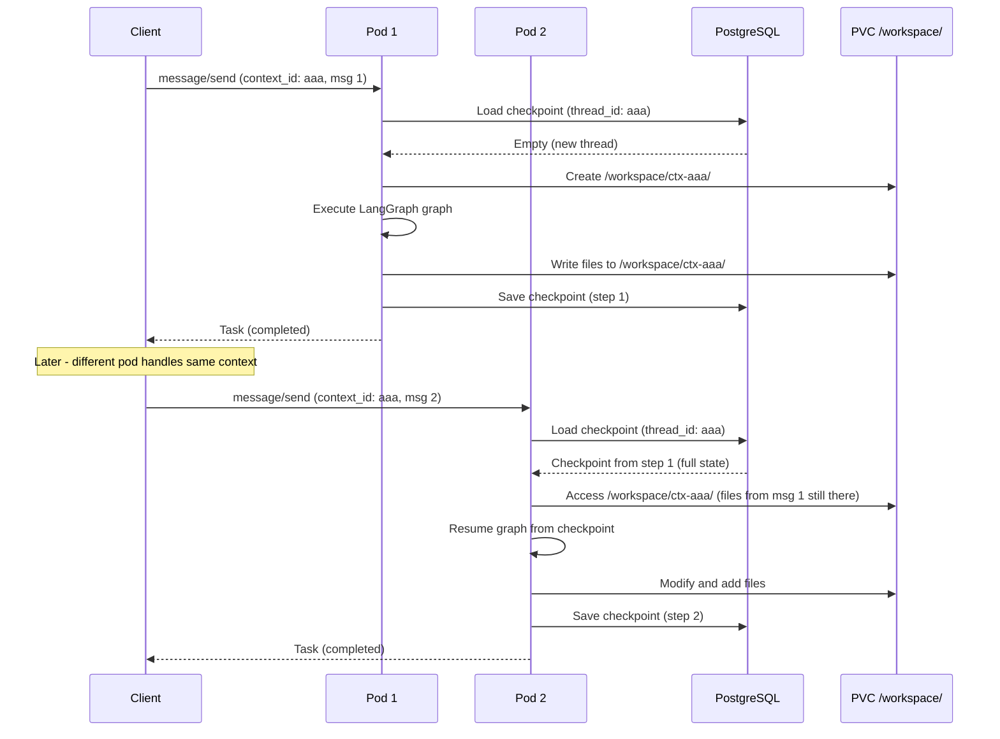
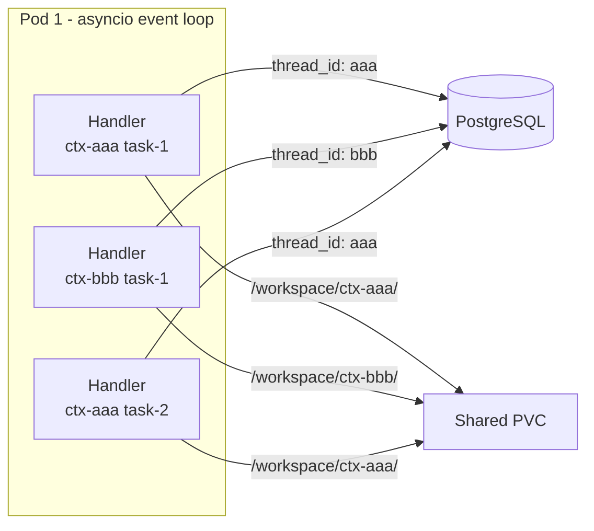
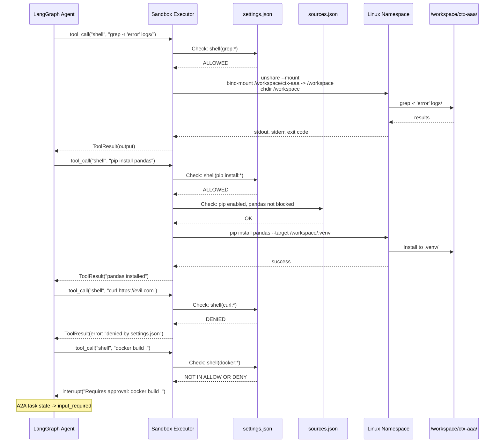

# Agent Context Isolation with Sandboxed Shell Execution

## Problem Statement

Kagenti agents need per-conversation persistent workspaces where they can safely run shell commands (grep, sed, bash scripts), install Python packages, clone git repos, and manage data files. Each A2A `context_id` must have its own isolated workspace with controlled access to tools, packages, and network resources.

## Architecture Overview



### Key Principles

- **Agent pod is immutable** - shell tools (grep, sed, bash, python, pip, git) are baked into the container image at build time. The container filesystem is read-only at runtime.
- **All mutable work happens on the PVC** - scripts, git clones, virtualenvs, data files live in per-context subdirectories on a shared ReadWriteMany PVC.
- **LangGraph checkpointing is separate** - graph state goes to PostgreSQL via `PostgresSaver`. The PVC holds workspace files, not agent execution state.
- **A2A `contextId` maps to LangGraph `thread_id`** - this mapping is native in LangGraph Platform and straightforward to implement in custom agents.
- **No context_id = no workspace** - if an A2A conversation has no `context_id`, the agent runs stateless without provisioning a workspace.

### Immutable Image + Mutable PVC

| What | Where | Mutable? |
|------|-------|----------|
| Shell tools (grep, sed, bash, awk, find) | Container image `/usr/bin/` | No |
| Python interpreter | Container image `/usr/bin/python3` | No |
| pip package manager | Container image `/usr/bin/pip` | No |
| Installed pip packages | PVC `/workspace/<ctx>/.venv/` | Yes (per context) |
| Scripts the agent writes | PVC `/workspace/<ctx>/scripts/` | Yes (per context) |
| Git repos cloned | PVC `/workspace/<ctx>/repos/` | Yes (per context) |
| Data files | PVC `/workspace/<ctx>/data/` | Yes (per context) |

## Storage: Shared RWX PVC with Per-Context Subdirectories

### Architecture

One ReadWriteMany PVC per agent type per namespace. Each `context_id` gets its own subdirectory. All agent pod replicas mount the same PVC at `/workspace`.



### PVC Specification

```yaml
apiVersion: v1
kind: PersistentVolumeClaim
metadata:
  name: weather-agent-workspace
  namespace: team1
  labels:
    kagenti.io/type: agent-workspace
    kagenti.io/agent: weather-service
spec:
  accessModes:
    - ReadWriteMany
  storageClassName: "${RWX_STORAGE_CLASS}"
  resources:
    requests:
      storage: 5Gi
```

### RWX Storage Class per Environment

| Environment | Solution | Storage Class |
|-------------|----------|---------------|
| Kind | nfs-ganesha-server-and-external-provisioner | `nfs` |
| OpenShift | ODF CephFS | `ocs-storagecluster-cephfs` |
| AWS HyperShift/ROSA | EFS CSI Driver | `efs-sc` |

Abstracted via Helm value: `storage.rwxStorageClass`.

### PVC Lifecycle



### Auto-Scaling Strategy

- Shared PVC starts at configurable initial size (default 5Gi)
- Expand when total usage exceeds 80%: 5 -> 10 -> 20Gi (capped, configurable max)
- Requires `allowVolumeExpansion: true` on StorageClass
- Note: EFS on AWS is elastic (auto-scales natively, no expansion needed)

### Metrics

- `kagenti_context_workspace_bytes{context_id, agent, namespace}` - disk usage per context
- `kagenti_workspace_pvc_usage_bytes{agent, namespace}` - total PVC usage
- `kagenti_workspace_pvc_capacity_bytes{agent, namespace}` - PVC capacity
- `kagenti_context_last_accessed_timestamp{context_id, agent, namespace}` - TTL tracking

## settings.json - Operation Control

Modeled after Claude Code's `settings.json`. Three tiers: **allow** (auto-approved), **deny** (always rejected), and everything in between goes through **HITL** (Human-in-the-Loop) via LangGraph `interrupt()`.

### Example settings.json

```json
{
  "_comment": "Agent sandbox operation settings. Operations not in allow or deny go through HITL.",
  "context_workspace": "/workspace/${CONTEXT_ID}",
  "permissions": {
    "allow": [
      "shell(grep:*)",
      "shell(sed:*)",
      "shell(awk:*)",
      "shell(find:*)",
      "shell(cat:*)",
      "shell(head:*)",
      "shell(tail:*)",
      "shell(wc:*)",
      "shell(sort:*)",
      "shell(uniq:*)",
      "shell(diff:*)",
      "shell(cut:*)",
      "shell(tr:*)",
      "shell(echo:*)",
      "shell(printf:*)",
      "shell(ls:*)",
      "shell(tree:*)",
      "shell(pwd:*)",
      "shell(mkdir:*)",
      "shell(cp:*)",
      "shell(mv:*)",
      "shell(touch:*)",

      "shell(python:*)",
      "shell(python3:*)",
      "shell(pip install:*)",
      "shell(pip list:*)",
      "shell(sh:*)",
      "shell(bash:*)",

      "shell(git clone:*)",
      "shell(git status:*)",
      "shell(git log:*)",
      "shell(git diff:*)",
      "shell(git add:*)",
      "shell(git commit:*)",
      "shell(git checkout:*)",
      "shell(git branch:*)",

      "file(read:${WORKSPACE}/**)",
      "file(write:${WORKSPACE}/**)",
      "file(delete:${WORKSPACE}/**)"
    ],
    "deny": [
      "shell(rm -rf /:*)",
      "shell(rm -rf /*:*)",
      "shell(sudo:*)",
      "shell(chmod 777:*)",
      "shell(curl:*)",
      "shell(wget:*)",
      "shell(nc:*)",
      "shell(ncat:*)",
      "network(outbound:*)",
      "file(read:/etc/shadow:*)",
      "file(write:/etc/**:*)",
      "file(read:/proc/**:*)",
      "shell(mount:*)",
      "shell(umount:*)",
      "shell(chroot:*)",
      "shell(nsenter:*)"
    ]
  }
}
```

### Three-Tier Enforcement Flow



### HITL Integration with LangGraph

- Operations not in allow or deny trigger `interrupt()` in the LangGraph graph
- The A2A task transitions to `input_required` state
- Client/UI shows the pending operation to the user for approval
- On approval, the graph resumes and executes the operation
- On denial, the graph receives a rejection and can choose an alternative approach

## sources.json - Agent Capabilities Declaration

Baked into the agent container image (per-agent-type). Declares what external resources the agent can access and what package managers are available on the image.

### Example sources.json

```json
{
  "_comment": "Declares what this agent can access and install. Baked into agent image.",
  "agent_type": "python-data-agent",
  "package_managers": {
    "pip": {
      "enabled": true,
      "registries": [
        {"name": "pypi", "url": "https://pypi.org/simple/", "trusted": true}
      ],
      "max_install_size_mb": 500,
      "blocked_packages": ["subprocess32", "pyautogui"]
    },
    "conda": {
      "enabled": false
    },
    "npm": {
      "enabled": false
    }
  },
  "web_access": {
    "enabled": true,
    "allowed_domains": [
      "api.github.com",
      "raw.githubusercontent.com",
      "pypi.org",
      "huggingface.co"
    ],
    "blocked_domains": [
      "*.internal",
      "metadata.google.internal"
    ]
  },
  "git": {
    "enabled": true,
    "allowed_remotes": [
      "https://github.com/*",
      "https://gitlab.com/*"
    ],
    "max_clone_size_mb": 1000
  },
  "runtime": {
    "languages": ["python3.11", "bash"],
    "interpreters": {
      "python": "/usr/bin/python3",
      "bash": "/bin/bash"
    },
    "max_execution_time_seconds": 300,
    "max_memory_mb": 2048
  }
}
```

### How settings.json and sources.json Interact

- `settings.json` controls **what operations are allowed** (allow/deny/HITL)
- `sources.json` controls **what resources exist** (registries, domains, languages)
- Example: `settings.json` allows `pip install:*`, but `sources.json` limits which registries pip can use and blocks specific packages
- Network access from `sources.json` is enforced at two levels: the Sandbox Executor validates URLs, and Istio/NetworkPolicy enforces at the network layer

### Per Agent Type Examples

| Agent Type | pip | npm | git | web | Languages |
|-----------|-----|-----|-----|-----|-----------|
| python-data-agent | PyPI | - | GitHub | PyPI, HuggingFace | python, bash |
| devops-agent | PyPI | npm | GitHub, GitLab | broad | python, bash, node |
| research-agent | PyPI | - | GitHub | broad | python, bash |

## Multi-Pod Scaling and Checkpointing

### Scaling Architecture



### How Multi-Pod Works

1. **Any pod can serve any context_id** - stateless routing via Istio gateway (round-robin)
2. **LangGraph state is in PostgreSQL** - `PostgresSaver` checkpointer ensures any pod can resume any context's graph state
3. **PVC is ReadWriteMany** - all pods mount the same shared workspace
4. **No pod-local state** - the agent pod is truly stateless; all state is in PostgreSQL + PVC

### Checkpointing Flow Across Pods



### Concurrent Contexts Within a Single Pod



- Multiple context_ids handled concurrently via asyncio
- Within the same context_id, multiple A2A tasks can run in parallel (per A2A spec)
- PostgreSQL checkpointer handles concurrent writes via row-level locking
- File operations within the same context workspace should use advisory locks (flock)

### A2A Protocol Context Semantics

Per the A2A specification:

- `contextId` groups tasks in a conversation. Multiple tasks can run in parallel within one context.
- A2A does NOT auto-cancel on new messages. Cancellation is explicit via `tasks/cancel`.
- New `message/send` with the same `contextId` creates a new task, it does not interrupt existing ones.
- Task states: `submitted` -> `working` -> `completed`/`failed`/`canceled`/`input_required`
- `input_required` is used for HITL interrupts (sandbox approval flow).

### LangGraph Checkpointer Configuration

```python
from langgraph.checkpoint.postgres.aio import AsyncPostgresSaver

async def create_checkpointer():
    return AsyncPostgresSaver.from_conn_string(
        os.environ["CHECKPOINT_DB_URL"]
    )

# A2A contextId maps to LangGraph thread_id
config = {"configurable": {"thread_id": context_id}}
result = await graph.ainvoke({"messages": [msg]}, config=config)
```

## Sandbox Executor - Shell Tool Execution

### Execution Flow



### Process Isolation (Default Mode)

Linux user namespaces + mount namespaces via `unshare`:

```bash
unshare --mount --user --map-root-user \
  --root /workspace/ctx-aaa \
  -- /bin/bash -c "grep -r 'error' logs/"
```

- Mount namespace: process only sees its context subdirectory as root
- User namespace: runs as mapped uid, no real root privileges
- Network: controlled by Istio/NetworkPolicy (not namespace-level)

### Per-Context Virtualenv

```bash
# On first pip install for a context:
python3 -m venv /workspace/ctx-aaa/.venv

# Subsequent installs:
/workspace/ctx-aaa/.venv/bin/pip install pandas

# Script execution uses the virtualenv:
VIRTUAL_ENV=/workspace/ctx-aaa/.venv \
PATH=/workspace/ctx-aaa/.venv/bin:$PATH \
python3 /workspace/ctx-aaa/scripts/analyze.py
```

### Resource Limits per Execution

From `sources.json`:
- `max_execution_time_seconds`: 300 (enforced via `timeout`)
- `max_memory_mb`: 2048 (enforced via cgroup or `ulimit`)

### Configurable Isolation Modes

Three modes, configurable per agent:

| Mode | Mechanism | Isolation | Overhead | Use Case |
|------|-----------|-----------|----------|----------|
| **default** | Linux namespaces (unshare) | Process + mount | Minimal | Standard agents |
| **sidecar** | Container per context | Container-level | Medium | Multi-tenant |
| **gvisor** | gVisor RuntimeClass | Kernel-level syscall | Higher I/O latency | Untrusted code |

Mode is set via agent configuration (Helm values or Component CRD).

## Context Workspace Directory Structure

```
/workspace/
└── ctx-abc123/
    ├── scripts/          # Agent-written scripts (.sh, .py)
    ├── data/             # Working data files
    ├── .venv/            # Python virtualenv (pip installs go here)
    │   ├── bin/
    │   ├── lib/
    │   └── pyvenv.cfg
    ├── repos/            # Git clones
    │   └── my-repo/
    ├── output/           # Agent output files
    └── .context.json     # Context metadata (created by context manager)
```

### .context.json

```json
{
  "context_id": "ctx-abc123",
  "agent": "weather-service",
  "namespace": "team1",
  "created_at": "2026-02-14T10:00:00Z",
  "last_accessed_at": "2026-02-14T10:05:00Z",
  "ttl_days": 7,
  "disk_usage_bytes": 52428800
}
```

## Decisions Made

| Decision | Choice | Rationale |
|----------|--------|-----------|
| Storage model | Shared RWX PVC + subdirs | Avoids dynamic PVC mounting, simpler than PVC-per-context |
| Default isolation | Linux namespaces (unshare) | Minimal overhead, works in Kind/OCP/HyperShift |
| Operation control | settings.json (allow/deny/HITL) | Modeled after Claude Code, familiar pattern |
| Capability declaration | sources.json per agent type | Baked into image, defines available tools |
| Checkpointing | LangGraph PostgresSaver | contextId maps to thread_id natively |
| PVC lifecycle | TTL-based cleanup (7 day default) | Contexts can be resumed within TTL window |
| PVC scaling | Volume expansion (doubling) | Start small, grow as needed |
| Multi-pod scaling | Stateless pods, shared PG + PVC | Any pod can serve any context |

## Next Steps

1. Create agent-examples worktree under `.worktrees/`
2. Implement base agent with sandbox executor and settings.json/sources.json
3. Add RWX PVC provisioning to Helm charts (per-environment StorageClass)
4. Implement context manager (workspace creation, TTL, metrics)
5. Add HITL interrupt flow to LangGraph agent
6. Write E2E tests for context isolation
